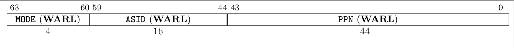

# 引言
本项目是运行在RISCV架构下的类UNIX操作系统内核。其实现了一套与Linux接口标准相同的部分接口（以使得部分Linux用户程序在此系统下运行）、一套简易的文件系统、进程信号系统、virtio-gpu驱动程序、网络协议栈等功能。\
本项目的代码可以在[https://github.com/MuoDoo/CirnoOS](https://github.com/MuoDoo/CirnoOS)处获取。

# 内核入口设计

CirnoOS是一款运行在QEMU模拟器下的操作系统，其依赖于RustSBI-QEMU为其引导启动并提供一套与硬件交互最基本的若干接口。RustSBI-QEMU编译好的二进制文件可见此项目bootloader文件夹内。\
QEMU模拟器模拟的virt硬件平台上，物理内存的起始地址为0x80000000，物理内存的默认大小为128Mib（即可用物理内存地址区间为[0x80000000,0x88000000) ）。我们使用的QEMU启动指令为：
```make
QEMU_ARGS := -machine virt \
             -bios $(BOOTLOADER) \
             -serial stdio \
             $(GUI_OPTION) \
             -device loader,file=$(KERNEL_BIN),addr=$(KERNEL_ENTRY_PA) \
             -drive file=$(FS_IMG),if=none,format=raw,id=x0 \
             -device virtio-blk-device,drive=x0 \
             -device virtio-gpu-device \
             -device virtio-keyboard-device \
             -device virtio-mouse-device \
             -device virtio-net-device,netdev=net0 \
             -netdev user,id=net0,hostfwd=udp::6200-:2000,hostfwd=tcp::6201-:80
```
用如上启动命令则会将作为bootloader的rustsbi-qemu.bin加载到物理地址0x80000000的位置上，而将内核镜像加载到物理地址0x80200000的位置上。\
内核镜像是CirnoCore文件夹下的内容编译并去除ELF文件元数据后得到的一份二进制文件，RustSBI会在完成一系列准备工作后从M Mode返回到S Mode并将PC(程序计数器)放置在0x80200000的物理地址上，从而使内核获得机器的控制权。\
上述指令同时还会加载一些virtio设备，并且挂载一块虚拟网卡并将其端口映射到物理机上，方便后续测试网络协议栈。

Cirno_Core.bin内部是一段entry.asm与内核共同链接得到的内容，下为entry.asm的内容:
```s
    .section .text.entry
    .globl _start
_start:
    la sp, boot_stack_top
    call rust_main

    .section .bss.stack
    .globl boot_stack_lower_bound
boot_stack_lower_bound:
    .space 4096 * 16
    .globl boot_stack_top
boot_stack_top:

```
这份代码会因为linker-qemu.ld而被链接器放置在0x80200000的物理地址上，从而为系统内核开放一个4090*16的bss空间，之后使用call rust_main来唤起RUST语言的rust_main()函数，将系统内核后续部分使用高级语言实现。\
至此内核已经被加载进入内存，并且获得了硬件的控制权。

# 内核初始化
在`Cirno_Core/src/main.rs`中，函数`rust_main`在内核载入后获得了程序的控制权，之后其要进行的第一个操作为`clear_bss()`，将`entry.asm`分配给我们的`.bss`段全部清零，之后正式开始内核的初始化部分。\
内核初始化要完成的第一个操作便是`mm::init()`来完成堆栈动态分配器的初始化，以及开启CPU分页机制，从此之后内核也使用自己的逻辑地址空间(在此之前我们极力避免内核在运行过程中申请内存)。之后进行UART的初始化以及Trap的初始化工作，由于已经有了自己的地址空间，可以直接使用堆栈分配器来创建所需变量的内存空间。在一切完成后开始构造文件系统以及进程控制块，之后构造第一个用户进程initproc，它是所有用户进程的祖先，并且负责回收所有僵尸进程。\
在这一切完成后，跳转回用户态，并且将控制权交给`initproc`，使其创建第一个子进程:`user_shell`。下为`initproc`程序的核心代码实现。
```rust
fn main() -> i32 {
    if fork() == 0 {
        exec("user_shell\0", &[core::ptr::null::<u8>()]);
    } else {
        loop {
            let mut exit_code: i32 = 0;
            let pid = wait(&mut exit_code);
            if pid == -1 {
                yield_();
                continue;
            }
            
            println!(
                "[initproc] Released a zombie process, pid={}, exit_code={}",
                pid,
                exit_code,
            );
            
        }
    }
    0
}

```
# 特权级机制
RISCV架构中一共定义了4种特权级：

| 级别 | 编码 | 名称 |
| --- | --- | ---| 
|0|00|用户模式(U Mode)|
1	|01|	监督模式(S Mode)
2	|10|	虚拟监督模式(H Mode)
3	|11	|机器模式(M Mode)

在RISCV架构中，只有M模式是必须实现的，其他特权级则可以根据在CPU上运行的程序情况来进行设计。本项目仅使用其中的M、S、U三种模式，H模式不涉及也未做代码实现。\
在本项目中仅有RustSBI运行在M Mode下，它作为操作内核的执行环境需要最高的权限级别。内核本身运行在S Mode下，可以通过执行S特权指令来对硬件进行管理。用户程序均运行在U Mode下，仅有最低的权限。\
本项目使用到的RISCV S Mode特权命令如下表：

| 指令 | 描述 |
| --- | --- |
sret	|从S模式返回到U模式
wfi	|处理器在空闲时进入低功耗模式等待中断
sfence.vma	|刷新TLB缓存
访问S模式CSR的指令	|通过访问stvec/sepc/scause/sscratch/stval/sstatus/satp等CSR来改变系统状态

下为开启分页机制时使用S Mode特权指令写入satp CSR寄存器以及使用sfence.vma刷新TLB缓存的一个例子(CirnoCore/src/mm/memory_set.rs)

```rust
pub fn activate(&self) {
        let satp = self.page_table.token();
        unsafe {
            satp::write(satp);
            asm!("sfence.vma");
        }
    }
```
# SV39分页机制
本项目采用SV39分页内存管理，如下图所示，内核以页为单位进行内存管理。

每个程序所使用的内存被分为若干个（虚拟）页面，可用的所有物理内存也被分为若干个（物理）页帧，二者的大小在设计上相同以便分配。每个虚拟页面中的内容实际上都存储在物理页帧上。每个虚拟页面都会有一个虚拟页号(VPN, Virtual Page Number)，每个物理地址同样有一个物理页号(PPN, Physical Page Number)。每个进程都有一个表示地址映射的页表(Page Table)，里面存放了这个进程使用的所有VPN与PPN之间的具体映射关系，这个表对系统内核可见，对应用程序不可见，被保存在内核的地址空间里。内核同样有一份自己的页表，但这份页表相较于应用程序的页表更为特殊，它内部的映射使用恒等映射。\
不同的页表中VPN可能存在重复，但映射得到的PPN都是不同的值（本项目未实现进程fork时的Copy On Write机制，故任何时刻两个不同页表中都不存在一个重复的PPN）。\
在内核刚启动的时候，MMU未被启用，此时无论CPU处于哪个特权级，访存的地址都会作为一个物理地址直接进行访问。我们通过修改S特权级的一个名为satp的CSR来启用分页机制，这会导致S Mode和U Mode下所有地址的访问都视为虚拟地址，它需要经过MMU机制转换为一个物理地址，再通过它访问物理内存。而M Mode对内存的访问，始终是物理地址（因为satp CSR无法影响到M Mode下的访存机制）。\
RISC-V架构下satp CSR的字段分布如下图：



其中MODE为页表实现方式（当设置为0时不启用分页机制，设置为8时SV39分页机制被启动），ASID为地址空间标识符，PPN为根页表所在的物理块号。给定一个虚拟地址，CPU就可以从三级页表的根页表开始一步步映射到一个物理地址。\
在CirnoCore/src/mm/address.rs中对虚拟地址、物理地址、虚拟页号、物理页号做了如下定义:
```rust
#[repr(C)]
#[derive(Copy, Clone, Ord, PartialOrd, Eq, PartialEq)]
pub struct PhysAddr(pub usize);

#[repr(C)]
#[derive(Copy, Clone, Ord, PartialOrd, Eq, PartialEq)]
pub struct VirtAddr(pub usize);

#[repr(C)]
#[derive(Copy, Clone, Ord, PartialOrd, Eq, PartialEq)]
pub struct PhysPageNum(pub usize);

#[repr(C)]
#[derive(Copy, Clone, Ord, PartialOrd, Eq, PartialEq)]
pub struct VirtPageNum(pub usize);

```
同时本项目还对他们之间的转换进行了代码实现（CirnoCore/src/mm/address.rs）：
```rust

impl From<usize> for PhysAddr {
    fn from(v: usize) -> Self {
        Self(v & ((1 << PA_WIDTH_SV39) - 1))
    }
}
impl From<usize> for PhysPageNum {
    fn from(v: usize) -> Self {
        Self(v & ((1 << PPN_WIDTH_SV39) - 1))
    }
}
impl From<usize> for VirtAddr {
    fn from(v: usize) -> Self {
        Self(v & ((1 << VA_WIDTH_SV39) - 1))
    }
}
impl From<usize> for VirtPageNum {
    fn from(v: usize) -> Self {
        Self(v & ((1 << VPN_WIDTH_SV39) - 1))
    }
}
impl From<PhysAddr> for usize {
    fn from(v: PhysAddr) -> Self {
        v.0
    }
}
impl From<PhysPageNum> for usize {
    fn from(v: PhysPageNum) -> Self {
        v.0
    }
}
impl From<VirtAddr> for usize {
    fn from(v: VirtAddr) -> Self {
        if v.0 >= (1 << (VA_WIDTH_SV39 - 1)) {
            v.0 | (!((1 << VA_WIDTH_SV39) - 1))
        } else {
            v.0
        }
    }
}
impl From<VirtPageNum> for usize {
    fn from(v: VirtPageNum) -> Self {
        v.0
    }
}
```
我们使用一个usize类型进行中转，设置每种类型转换为usize的方式以及usize转换为对应类型的方式，从而实现了这四种类型两两之间任意转换的机制。\
我们采用的分页机制中，单个页面大小被设置为4KiB，每个虚拟页面和物理页帧都会对齐到这个大小，而4KiB需要12位字节地址来表示，因此虚拟地址和物理地址都被分为两部分：低12位为页内偏移，虚拟地址的高27位（在SV39机制下每个虚拟地址为39位）作为它的VPN，同理物理地址的高44位（在SV39机制下每个物理地址为56位）为它的PPN。\
而地址转换是以页为单位的，所以在地址转换前后页内偏移部分不变，可以认为MMU仅仅将虚拟地址内27位VPN转化为44位PPN，最后拼接上页内偏移得到56位物理地址。\
下图为SV39分页模式下的页表项(PTE, Page Table Entry)：\

其中[53:10]是PPN，最低的8位为标志位，它们的含义如下：
|名称|功能|
|---|---|
V	|当V=1时，页表项才是合法的。
R/W/X|	分别控制这个页表项对应的虚拟页面是否允许读/写/执行
U	|控制这个页表项对应的虚拟页面是否在CPU处于U Mode下时访问
A	|处理器记录自从页表项上这一位被清零后，页表项对应的虚拟地址是否被访问过。
D	|处理器记录自从页表项上这一位被清零后，页表项对应的虚拟地址是否被修改过。
G	|防止TLB刷新此页表项。

这八个标志位以及页表项在CirnoCore/src/mm/page_table.rs中进行了定义：
```rust
bitflags! {
    pub struct PTEFlags: u8 {
        const V = 1 << 0;
        const R = 1 << 1;
        const W = 1 << 2;
        const X = 1 << 3;
        const U = 1 << 4;
        const G = 1 << 5;
        const A = 1 << 6;
        const D = 1 << 7;
    }
}
```
SV39机制下多级页表具体转换机制如下：


在CirnoCore/src/linker-qemu.ld中，使用ekernel指定了内核数据的终止物理地址，在它之后的物理地址都是可用的。在CirnoCore/src/config.rs中，我们指明了KERNEL_HEAP_SIZE=0x100_0000,KERNEL_STACK_SInsdZE=4096*2。\
我们可以借此实现一个物理页帧管理器(CirnoCore/src/mm/frame_allocator.rs)：
```rust
pub struct StackFrameAllocator {
    current: usize,
    end: usize,
    recycled: Vec<usize>,
}

impl StackFrameAllocator {
    pub fn init(&mut self, l: PhysPageNum, r: PhysPageNum) {
        self.current = l.0;
        self.end = r.0;
        // println!("last {} Physical Frames.", self.end - self.current);
    }
}
impl FrameAllocator for StackFrameAllocator {
    fn new() -> Self {
        Self {
            current: 0,
            end: 0,
            recycled: Vec::new(),
        }
    }
    fn alloc(&mut self) -> Option<PhysPageNum> {
        if let Some(ppn) = self.recycled.pop() {
            Some(ppn.into())
        } else if self.current == self.end {
            None
        } else {
            self.current += 1;
            Some((self.current - 1).into())
        }
    }
    fn alloc_more(&mut self, pages: usize) -> Option<Vec<PhysPageNum>> {
        if self.current + pages >= self.end {
            None
        } else {
            self.current += pages;
            let arr: Vec<usize> = (1..pages + 1).collect();
            let v = arr.iter().map(|x| (self.current - x).into()).collect();
            Some(v)
        }
    }
    fn dealloc(&mut self, ppn: PhysPageNum) {
        let ppn = ppn.0;
        // validity check
        if ppn >= self.current || self.recycled.iter().any(|&v| v == ppn) {
            panic!("Frame ppn={:#x} has not been allocated!", ppn);
        }
        // recycle
        self.recycled.push(ppn);
    }
}
```
接下来我们可以在内核中访问一个特定的物理页帧(CirnoCore/src/mm/address.rs)：
```rust

impl PhysPageNum {
    pub fn get_pte_array(&self) -> &'static mut [PageTableEntry] {
        let pa: PhysAddr = (*self).into();
        unsafe { core::slice::from_raw_parts_mut(pa.0 as *mut PageTableEntry, 512) }
    }
    pub fn get_bytes_array(&self) -> &'static mut [u8] {
        let pa: PhysAddr = (*self).into();
        unsafe { core::slice::from_raw_parts_mut(pa.0 as *mut u8, 4096) }
    }
    pub fn get_mut<T>(&self) -> &'static mut T {
        let pa: PhysAddr = (*self).into();
        pa.get_mut()
    }
}
```
建立与拆除虚实地址的映射也只需要模拟三级页表的访问过程即可(CirnoCore/src/mm/page_table.rs)：
```rust
#[allow(unused)]
    pub fn map(&mut self, vpn: VirtPageNum, ppn: PhysPageNum, flags: PTEFlags) {
        let pte = self.find_pte_create(vpn).unwrap();
        assert!(!pte.is_valid(), "vpn {:?} is mapped before mapping", vpn);
        *pte = PageTableEntry::new(ppn, flags | PTEFlags::V);
    }
    #[allow(unused)]
    pub fn unmap(&mut self, vpn: VirtPageNum) {
        let pte = self.find_pte(vpn).unwrap();
        assert!(pte.is_valid(), "vpn {:?} is invalid before unmapping", vpn);
        *pte = PageTableEntry::empty();
    }
```

# 地址空间
页表只能以页为单位帮助我们维护一个虚拟地址到物理地址的映射，它本身对于计算机系统的整个内存空间并没有一个全面的掌控和描述。本项目借助地址空间的抽象，通过对不同页表的管理，来完成对不同应用程序以及操作系统内核自身所在的虚拟内存、以及虚拟内存到物理内存的映射的管理。本项目借助基于页表的各种数据结构来实现地址空间的抽象。\
本项目首先在CirnoCore/src/mm/memory_set.rs中定义了逻辑段(MapArea)：
```rust

pub struct MapArea {
    vpn_range: VPNRange,
    data_frames: BTreeMap<VirtPageNum, FrameTracker>,
    map_type: MapType,
    map_perm: MapPermission,
}
```
逻辑段是指地址空间中一段连续的实际可用（MMU通过多级查表可以正确转换出物理地址）的虚拟地址区间，其中所有的逻辑页面都以一种相同的方式（Identical/Framed/Linear）映射到物理页帧，具有相同的权限（可读/可写/可执行）。\
逻辑段提供了初始化、从其他逻辑段复制、添加映射、去除映射等多种成员函数(CirnoCore/src/mm/memory_set.rs)：
```rust
impl MapArea {
    pub fn new(
        start_va: VirtAddr,
        end_va: VirtAddr,
        map_type: MapType,
        map_perm: MapPermission,
    ) -> Self {
        let start_vpn: VirtPageNum = start_va.floor();
        let end_vpn: VirtPageNum = end_va.ceil();
        Self {
            vpn_range: VPNRange::new(start_vpn, end_vpn),
            data_frames: BTreeMap::new(),
            map_type,
            map_perm,
        }
    }
    pub fn from_another(another: &MapArea) -> Self {
        Self {
            vpn_range: VPNRange::new(another.vpn_range.get_start(), another.vpn_range.get_end()),
            data_frames: BTreeMap::new(),
            map_type: another.map_type,
            map_perm: another.map_perm,
        }
    }
    pub fn map_one(&mut self, page_table: &mut PageTable, vpn: VirtPageNum) {
        let ppn: PhysPageNum;
        match self.map_type {
            MapType::Identical => {
                ppn = PhysPageNum(vpn.0);
            }
            MapType::Framed => {
                let frame = frame_alloc().unwrap();
                ppn = frame.ppn;
                self.data_frames.insert(vpn, frame);
            }
            MapType::Linear(pn_offset) => {
                // check for sv39
                assert!(vpn.0 < (1usize << 27));
                ppn = PhysPageNum((vpn.0 as isize + pn_offset) as usize);
            }
        }
        let pte_flags = PTEFlags::from_bits(self.map_perm.bits).unwrap();
        page_table.map(vpn, ppn, pte_flags);
    }
    pub fn unmap_one(&mut self, page_table: &mut PageTable, vpn: VirtPageNum) {
        if self.map_type == MapType::Framed {
            self.data_frames.remove(&vpn);
        }
        page_table.unmap(vpn);
    }
    pub fn map(&mut self, page_table: &mut PageTable) {
        for vpn in self.vpn_range {
            self.map_one(page_table, vpn);
        }
    }
    pub fn unmap(&mut self, page_table: &mut PageTable) {
        for vpn in self.vpn_range {
            self.unmap_one(page_table, vpn);
        }
    }
    /// data: start-aligned but maybe with shorter length
    /// assume that all frames were cleared before
    pub fn copy_data(&mut self, page_table: &mut PageTable, data: &[u8]) {
        assert_eq!(self.map_type, MapType::Framed);
        let mut start: usize = 0;
        let mut current_vpn = self.vpn_range.get_start();
        let len = data.len();
        loop {
            let src = &data[start..len.min(start + PAGE_SIZE)];
            let dst = &mut page_table
                .translate(current_vpn)
                .unwrap()
                .ppn()
                .get_bytes_array()[..src.len()];
            dst.copy_from_slice(src);
            start += PAGE_SIZE;
            if start >= len {
                break;
            }
            current_vpn.step();
        }
    }
}
```
其中核心方法为map_one，用来将传入的页表中的某个VPN映射到PPN，根据其三种不同的映射方式分别进行处理。\
我们用一系列有关联的MapArea所构成的集合以及当前地址空间的页表来表示地址空间，其定义在CirnoCore/src/mm/memory_set.rs中实现：
```rust
pub struct MemorySet {
    page_table: PageTable,
    areas: Vec<MapArea>,
}
```
如代码所示，它包含了一个当前地址空间的多级页表page_table，以及一个逻辑段的向量areas。其中page_table下挂载了所有多级页表的节点所在的物理页帧，而areas内挂载了对应逻辑段的数据所在的物理页帧。这是一种RAII编程风格，当MemorySet生命周期结束后，所有的物理页帧都会被回收(我们在CirnoCore/src/mm/frame_allocator.rs中定义了它们的析构函数)。\
MemorySet的核心方法如下(CirnoCore/src/mm/memory_set.rs)：
```rust

impl MemorySet {
    pub fn new_bare() -> Self {
        Self {
            page_table: PageTable::new(),
            areas: Vec::new(),
        }
    }
    pub fn token(&self) -> usize {
        self.page_table.token()
    }
    /// Assume that no conflicts.
    pub fn insert_framed_area(
        &mut self,
        start_va: VirtAddr,
        end_va: VirtAddr,
        permission: MapPermission,
    ) {
        self.push(
            MapArea::new(start_va, end_va, MapType::Framed, permission),
            None,
        );
    }
    pub fn remove_area_with_start_vpn(&mut self, start_vpn: VirtPageNum) {
        if let Some((idx, area)) = self
            .areas
            .iter_mut()
            .enumerate()
            .find(|(_, area)| area.vpn_range.get_start() == start_vpn)
        {
            area.unmap(&mut self.page_table);
            self.areas.remove(idx);
        }
    }
    /// Add a new MapArea into this MemorySet.
    /// Assuming that there are no conflicts in the virtual address
    /// space.
    pub fn push(&mut self, mut map_area: MapArea, data: Option<&[u8]>) {
        map_area.map(&mut self.page_table);
        if let Some(data) = data {
            map_area.copy_data(&mut self.page_table, data);
        }
        self.areas.push(map_area);
    }
    /// Mention that trampoline is not collected by areas.
    fn map_trampoline(&mut self) {
        self.page_table.map(
            VirtAddr::from(TRAMPOLINE).into(),
            PhysAddr::from(strampoline as usize).into(),
            PTEFlags::R | PTEFlags::X,
        );
    }
    /// Without kernel stacks.
    pub fn new_kernel() -> Self {
        //碍于篇幅所限，未给出详细的实现代码，可在对应文件中查看。
    }
    /// Include sections in elf and trampoline,
    /// also returns user_sp_base and entry point.
    pub fn from_elf(elf_data: &[u8]) -> (Self, usize, usize) {
        //碍于篇幅所限，未给出详细的实现代码，可在对应文件中查看。
    }
    pub fn from_existed_user(user_space: &MemorySet) -> MemorySet {
        let mut memory_set = Self::new_bare();
        // map trampoline
        memory_set.map_trampoline();
        // copy data sections/trap_context/user_stack
        for area in user_space.areas.iter() {
            let new_area = MapArea::from_another(area);
            memory_set.push(new_area, None);
            // copy data from another space
            for vpn in area.vpn_range {
                let src_ppn = user_space.translate(vpn).unwrap().ppn();
                let dst_ppn = memory_set.translate(vpn).unwrap().ppn();
                dst_ppn
                    .get_bytes_array()
                    .copy_from_slice(src_ppn.get_bytes_array());
            }
        }
        memory_set
    }
    pub fn activate(&self) {
        let satp = self.page_table.token();
        unsafe {
            satp::write(satp);
            asm!("sfence.vma");
        }
    }
    pub fn translate(&self, vpn: VirtPageNum) -> Option<PageTableEntry> {
        self.page_table.translate(vpn)
    }
    pub fn recycle_data_pages(&mut self) {
        //*self = Self::new_bare();
        self.areas.clear();
    }
}
```

new_bare方法创建一个新的地址空间，push方法可以在当前地址空间插入一个新的逻辑段，如果是以Framed方式映射到物理内存，还可以在被映射到的物理页帧上写入一些初始化数据\
insert_framed_area方法调用push方法在当前地址空间插入一个framed的逻辑段，文件内还有两个重要方法：new_kernel、from_elf。new_kernel用来生成内核的地址空间，from_elf根据解析ELF文件格式的内容，解析出各数据段并生成对应的地址空间。

# 进程
本项目是一个支持多进程的操作系统，提供了fork、waitpid、exec、kill等与进程相关的系统调用(CirnoCore/src/syscall/process.rs):
```rust
//碍于篇幅所限，未给出详细的实现代码，可在对应文件中查看。
pub fn sys_fork() -> isize {
}
pub fn sys_exec(path: *const u8, mut args: *const usize) -> isize {
}
pub fn sys_waitpid(pid: isize, exit_code_ptr: *mut i32) -> isize {
}
pub fn sys_kill(pid: usize, signal: u32) -> isize {
}
```

在CirnoCore/src/task/process.rs中，我们定义了一个进程控制块：
```rust
pub struct ProcessControlBlock {
    // immutable
    pub pid: PidHandle,
    // mutable
    inner: UPIntrFreeCell<ProcessControlBlockInner>,
}
```
Pid是初始化后就不会发生改变的数据，我们将其直接放在PCB当中，对在运行时可能发生改变的数据，我们将其放在inner当中，使用一个UPInitrFreeCell包裹，以便后续对其生成可变引用，提供可变性（这是由RUST语言设计时的安全性需求保证的。对于可变的数据与不可变的数据，编译器强制我们分别处理）。除pid外，核心内容是一个ProcessControlBlockInner数据类型，我们在CirnoCore/src/task/process.rs中进行了定义
```rust
pub struct ProcessControlBlockInner {
    pub is_zombie: bool,
    pub memory_set: MemorySet,
    pub parent: Option<Weak<ProcessControlBlock>>,
    pub children: Vec<Arc<ProcessControlBlock>>,
    pub exit_code: i32,
    pub fd_table: Vec<Option<Arc<dyn File + Send + Sync>>>,
    pub signals: SignalFlags,
    pub tasks: Vec<Option<Arc<TaskControlBlock>>>,
    pub task_res_allocator: RecycleAllocator,
    pub mutex_list: Vec<Option<Arc<dyn Mutex>>>,
    pub semaphore_list: Vec<Option<Arc<Semaphore>>>,
    pub condvar_list: Vec<Option<Arc<Condvar>>>,
}
```
这个数据结构包含了我们对进程控制中，所需要的一切可变数据（它们在进程运行过程中可能会发生改变）。\
ProcessControlBlockInner提供的方法主要是对其中一些字段的便捷访问：
```rust
impl ProcessControlBlockInner {
    #[allow(unused)]
    pub fn get_user_token(&self) -> usize {
        self.memory_set.token()
    }

    pub fn alloc_fd(&mut self) -> usize {
        if let Some(fd) = (0..self.fd_table.len()).find(|fd| self.fd_table[*fd].is_none()) {
            fd
        } else {
            self.fd_table.push(None);
            self.fd_table.len() - 1
        }
    }

    pub fn alloc_tid(&mut self) -> usize {
        self.task_res_allocator.alloc()
    }

    pub fn dealloc_tid(&mut self, tid: usize) {
        self.task_res_allocator.dealloc(tid)
    }

    pub fn thread_count(&self) -> usize {
        self.tasks.len()
    }

    pub fn get_task(&self, tid: usize) -> Arc<TaskControlBlock> {
        self.tasks[tid].as_ref().unwrap().clone()
    }
}
```
任务控制块提供以下方法(CirnoCore/src/task/process.rs)：
```rust
//碍于篇幅所限，未给出详细的实现代码，可在对应文件中查看。
impl ProcessControlBlock {
    pub fn inner_exclusive_access(&self) -> UPIntrRefMut<'_, ProcessControlBlockInner> {
        self.inner.exclusive_access()
    }

    pub fn new(elf_data: &[u8]) -> Arc<Self> {
    }
    /// Only support processes with a single thread.
    pub fn exec(self: &Arc<Self>, elf_data: &[u8], args: Vec<String>) {
    }

    /// Only support processes with a single thread.
    pub fn fork(self: &Arc<Self>) -> Arc<Self> {
    }

    pub fn getpid(&self) -> usize {
    }
}
```
# 任务管理器
有了进程的概念后，还不足以管理整个系统中所有的进程，于是我们实现了一个简易的任务管理器`TaskManager`，负责管理所有的进程控制块。
核心实现在CirnoCore/src/task/anager.rs中：
```rust
impl TaskManager {
    pub fn new() -> Self {
        Self {
            ready_queue: VecDeque::new(),
        }
    }
    pub fn add(&mut self, task: Arc<TaskControlBlock>) {
        self.ready_queue.push_back(task);
    }
    pub fn fetch(&mut self) -> Option<Arc<TaskControlBlock>> {
        self.ready_queue.pop_front()
    }
}
pub fn add_task(task: Arc<TaskControlBlock>) {
    TASK_MANAGER.exclusive_access().add(task);
}

pub fn wakeup_task(task: Arc<TaskControlBlock>) {
    let mut task_inner = task.inner_exclusive_access();
    task_inner.task_status = TaskStatus::Ready;
    drop(task_inner);
    add_task(task);
}

pub fn fetch_task() -> Option<Arc<TaskControlBlock>> {
    TASK_MANAGER.exclusive_access().fetch()
}

pub fn pid2process(pid: usize) -> Option<Arc<ProcessControlBlock>> {
    let map = PID2PCB.exclusive_access();
    map.get(&pid).map(Arc::clone)
}

pub fn insert_into_pid2process(pid: usize, process: Arc<ProcessControlBlock>) {
    PID2PCB.exclusive_access().insert(pid, process);
}

pub fn remove_from_pid2process(pid: usize) {
    let mut map = PID2PCB.exclusive_access();
    if map.remove(&pid).is_none() {
        panic!("cannot find pid {} in pid2task!", pid);
    }
}
```
他将所有的PCB放在一个双端队列中，提供了add、fetch、wakeup_task等方法，以便对PCB进行管理。\
这里还提供了一个全局的PID2PCB映射，用来将PID映射到对应的PCB上，以便在系统调用中根据PID找到对应的PCB。\
我们的任务调度算法是一个最简单的FIFO算法，即每次从队列头取出一个PCB来执行。\
同时由于使用了Arc智能指针，可以在多个地方引用同一个PCB，这样我们可以在多个地方对同一个PCB进行操作。由于当指针引用计数为0时，PCB会被自动回收，所以我们不需要担心内存泄漏的问题。
# 处理器调度
处理器管理器`Processor`负责管理处理器，它提供了一个全局的`PROCESSOR`变量，用来表示处理器(CirnoCore/src/task/processor.rs)：
```rust
pub struct Processor {
    current: Option<Arc<TaskControlBlock>>,
    idle_task_cx: TaskContext,
}

impl Processor {
    pub fn new() -> Self {
        Self {
            current: None,
            idle_task_cx: TaskContext::zero_init(),
        }
    }
    fn get_idle_task_cx_ptr(&mut self) -> *mut TaskContext {
        &mut self.idle_task_cx as *mut _
    }
    pub fn take_current(&mut self) -> Option<Arc<TaskControlBlock>> {
        self.current.take()
    }
    pub fn current(&self) -> Option<Arc<TaskControlBlock>> {
        self.current.as_ref().map(Arc::clone)
    }
}

lazy_static! {
    pub static ref PROCESSOR: UPIntrFreeCell<Processor> =
        unsafe { UPIntrFreeCell::new(Processor::new()) };
}
```
它提供了一个`current`字段，用来表示当前正在执行的任务，以及一个`idle_task_cx`字段，用来保存任务的上下文。\
由于我们采用抢占式多任务，所以在每次任务切换时，我们需要保存当前任务的上下文，并加载下一个任务的上下文：
```rust
pub fn run_tasks() {
    loop {
        let mut processor = PROCESSOR.exclusive_access();
        if let Some(task) = fetch_task() {
            let idle_task_cx_ptr = processor.get_idle_task_cx_ptr();
            // access coming task TCB exclusively
            let next_task_cx_ptr = task.inner.exclusive_session(|task_inner| {
                task_inner.task_status = TaskStatus::Running;
                &task_inner.task_cx as *const TaskContext
            });
            processor.current = Some(task);
            // release processor manually
            drop(processor);
            unsafe {
                __switch(idle_task_cx_ptr, next_task_cx_ptr);
            }
        } else {
            println!("no tasks available in run_tasks");
        }
    }
}
pub fn take_current_task() -> Option<Arc<TaskControlBlock>> {
    PROCESSOR.exclusive_access().take_current()
}

pub fn current_task() -> Option<Arc<TaskControlBlock>> {
    PROCESSOR.exclusive_access().current()
}

pub fn current_process() -> Arc<ProcessControlBlock> {
    current_task().unwrap().process.upgrade().unwrap()
}

pub fn current_user_token() -> usize {
    let task = current_task().unwrap();
    task.get_user_token()
}

pub fn current_trap_cx() -> &'static mut TrapContext {
    current_task()
        .unwrap()
        .inner_exclusive_access()
        .get_trap_cx()
}

pub fn current_trap_cx_user_va() -> usize {
    current_task()
        .unwrap()
        .inner_exclusive_access()
        .res
        .as_ref()
        .unwrap()
        .trap_cx_user_va()
}

pub fn current_kstack_top() -> usize {
    current_task().unwrap().kstack.get_top()
}
```
`take_current_task`可以获取当前正在执行的任务。\
`current_task`可以获取当前正在执行的任务的引用。\
`current_process`可以获取当前正在执行的进程。\
`current_user_token`可以获取当前正在执行的任务的用户态页表的token。\
`current_trap_cx`可以获取当前正在执行的任务的陷阱上下文。\
`current_trap_cx_user_va`可以获取当前正在执行的任务的陷阱上下文的用户态虚拟地址。\
`current_kstack_top`可以获取当前正在执行的任务的内核栈的栈顶。\
并且他有一个不同的idle控制流，运行在这个CPU的启动栈上,当CPU无事可做时，就会使它一直在CPU上运行。功能是尝试从任务管理器中获取一个任务并执行它。\
当一个进程用尽了它的时间片，或者主动调用`yield`系统调用交出CPU使用权，内核会调用`schedule`函数来切换到idle控制流。
```rust
pub fn schedule(switched_task_cx_ptr: *mut TaskContext) {
    let idle_task_cx_ptr =
        PROCESSOR.exclusive_session(|processor| processor.get_idle_task_cx_ptr());
    unsafe {
        __switch(switched_task_cx_ptr, idle_task_cx_ptr);
    }
}
```
# Trap管理机制
我们在CirnoCore/src/trap/mod.rs中设置了中断处理程序入口：
```rust

pub fn init() {
    set_kernel_trap_entry();
}

fn set_kernel_trap_entry() {
    extern "C" {
        fn __alltraps();
        fn __alltraps_k();
    }
    let __alltraps_k_va = __alltraps_k as usize - __alltraps as usize + TRAMPOLINE;
    unsafe {
        stvec::write(__alltraps_k_va, TrapMode::Direct);
        sscratch::write(trap_from_kernel as usize);
    }
}

fn set_user_trap_entry() {
    unsafe {
        stvec::write(TRAMPOLINE as usize, TrapMode::Direct);
    }
}
```
中断处理所需要的汇编代码部分存放在CirnoCore/src/trap/trap.S中：
```asm
.altmacro
.macro SAVE_GP n
    sd x\n, \n*8(sp)
.endm
.macro LOAD_GP n
    ld x\n, \n*8(sp)
.endm
    .section .text.trampoline
    .globl __alltraps
    .globl __restore
    .globl __alltraps_k
    .globl __restore_k
    .align 2
__alltraps:
    csrrw sp, sscratch, sp
    # now sp->*TrapContext in user space, sscratch->user stack
    # save other general purpose registers
    sd x1, 1*8(sp)
    # skip sp(x2), we will save it later
    sd x3, 3*8(sp)
    # skip tp(x4), application does not use it
    # save x5~x31
    .set n, 5
    .rept 27
        SAVE_GP %n
        .set n, n+1
    .endr
    # we can use t0/t1/t2 freely, because they have been saved in TrapContext
    csrr t0, sstatus
    csrr t1, sepc
    sd t0, 32*8(sp)
    sd t1, 33*8(sp)
    # read user stack from sscratch and save it in TrapContext
    csrr t2, sscratch
    sd t2, 2*8(sp)
    # load kernel_satp into t0
    ld t0, 34*8(sp)
    # load trap_handler into t1
    ld t1, 36*8(sp)
    # move to kernel_sp
    ld sp, 35*8(sp)
    # switch to kernel space
    csrw satp, t0
    sfence.vma
    # jump to trap_handler
    jr t1

__restore:
    # a0: *TrapContext in user space(Constant); a1: user space token
    # switch to user space
    csrw satp, a1
    sfence.vma
    csrw sscratch, a0
    mv sp, a0
    # now sp points to TrapContext in user space, start restoring based on it
    # restore sstatus/sepc
    ld t0, 32*8(sp)
    ld t1, 33*8(sp)
    csrw sstatus, t0
    csrw sepc, t1
    # restore general purpose registers except x0/sp/tp
    ld x1, 1*8(sp)
    ld x3, 3*8(sp)
    .set n, 5
    .rept 27
        LOAD_GP %n
        .set n, n+1
    .endr
    # back to user stack
    ld sp, 2*8(sp)
    sret

    .align 2
__alltraps_k:
    addi sp, sp, -34*8 
    sd x1, 1*8(sp)
    sd x3, 3*8(sp)
    .set n, 5
    .rept 27
        SAVE_GP %n
        .set n, n+1
    .endr
    csrr t0, sstatus
    csrr t1, sepc
    sd t0, 32*8(sp)
    sd t1, 33*8(sp)
    mv a0, sp
    csrr t2, sscratch
    jalr t2

__restore_k:
    ld t0, 32*8(sp)
    ld t1, 33*8(sp)
    csrw sstatus, t0
    csrw sepc, t1
    ld x1, 1*8(sp)
    ld x3, 3*8(sp)
    .set n, 5
    .rept 27
        LOAD_GP %n
        .set n, n+1
    .endr
    addi sp, sp, 34*8
    sret
```
当应用陷入Trap时，硬件会设置一些CSR并且以S Mode跳转到`__alltraps`，这个函数会将TrapContext保存在用户栈上，然后切换到内核栈上，调用内核的中断处理函数。\
当中断处理函数返回时，会调用`__restore`，这个函数会将TrapContext恢复到用户栈上，然后切换到用户栈上，返回到用户态。\
同时我们在CirnoCore/src/trap/context.rs中定义了一个TrapContext结构体，用来保存中断处理时的上下文：
```rust
#[repr(C)]
#[derive(Debug)]
pub struct TrapContext {
    pub x: [usize; 32],
    pub sstatus: Sstatus,
    pub sepc: usize,
    pub kernel_satp: usize,
    pub kernel_sp: usize,
    pub trap_handler: usize,
}
```
其中x数组保存了通用寄存器的值\
sstatus保存了sstatus寄存器的值\
sepc保存了sepc寄存器的值\
kernel_satp保存了内核地址空间的token(即内核也表的起始物理地址)\
kernel_sp保存了内核栈的栈顶虚拟地址\
trap_handler保存了中断处理函数的虚拟地址。\
接下来还需要考虑在切换地址空间前后指令是否平滑。我们在连接器中将trap.S的整段汇编代码放在了.text.trampoline段中，这段地址在所有地址空间中，都被方式在了地址空间的最高虚拟页面上，这样我们在切换地址空间时，不需要担心PC找不到下一个要指向的地址。\
因为在Trap前后的一小段时间里，有一个极端的情况:
刚产生Trap的时候，CPU已经进入了内核态，但此时执行代码和访问数据还在用户态的地址空间，在这段时间里，CPU可能会执行一些指令，访问一些数据，这些指令和数据都是在用户态的地址空间中的，如果此时发生了地址空间切换，那么这些指令和数据就会找不到，这就会导致CPU异常。\
为了解决这个问题，我们才设计了跳板空间，即在所有的地址空间中，都有一个相同的虚拟地址空间，这个虚拟地址空间中的代码和数据都是相同的，这样在切换地址空间时，CPU不需要切换PC，就可以继续执行。
我们具体的trap_handler函数在CirnoCore/src/trap/mod.rs中实现：
```rust
pub fn trap_handler() -> ! {
    set_kernel_trap_entry();
    let scause = scause::read();
    let stval = stval::read();
    // println!("into {:?}", scause.cause());
    match scause.cause() {
        Trap::Exception(Exception::UserEnvCall) => {
            // jump to next instruction anyway
            let mut cx = current_trap_cx();
            cx.sepc += 4;

            enable_supervisor_interrupt();

            // get system call return value
            let result = syscall(cx.x[17], [cx.x[10], cx.x[11], cx.x[12]]);
            // cx is changed during sys_exec, so we have to call it again
            cx = current_trap_cx();
            cx.x[10] = result as usize;
        }
        Trap::Exception(Exception::StoreFault)
        | Trap::Exception(Exception::StorePageFault)
        | Trap::Exception(Exception::InstructionFault)
        | Trap::Exception(Exception::InstructionPageFault)
        | Trap::Exception(Exception::LoadFault)
        | Trap::Exception(Exception::LoadPageFault) => {
            /*
            println!(
                "[kernel] {:?} in application, bad addr = {:#x}, bad instruction = {:#x}, kernel killed it.",
                scause.cause(),
                stval,
                current_trap_cx().sepc,
            );
            */
            current_add_signal(SignalFlags::SIGSEGV);
        }
        Trap::Exception(Exception::IllegalInstruction) => {
            current_add_signal(SignalFlags::SIGILL);
        }
        Trap::Interrupt(Interrupt::SupervisorTimer) => {
            set_next_trigger();
            check_timer();
            suspend_current_and_run_next();
        }
        Trap::Interrupt(Interrupt::SupervisorExternal) => {
            crate::board::irq_handler();
        }
        _ => {
            panic!(
                "Unsupported trap {:?}, stval = {:#x}!",
                scause.cause(),
                stval
            );
        }
    }
    // check signals
    if let Some((errno, msg)) = check_signals_of_current() {
        println!("[kernel] {}", msg);
        exit_current_and_run_next(errno);
    }
    trap_return();
}
```
# 文件系统
本项目采用了一个简易的文件系统`easyfs`，能够对持久存储设备资源进行管理。\
这个文件系统进行了很多简化：
* 仅存在一个根目录
* 无权限区分，所有文件都是可读可写可执行的
* 无软硬链接
* 仅实现了部分必要的系统调用

在读写一个文件时，我们需要先打开这个文件，在CirnoCore/src/syscall/fs.rs中实现了打开文件的系统调用：
```rust
pub fn sys_open(path: *const u8, flags: u32) -> isize {
    let process = current_process();
    let token = current_user_token();
    let path = translated_str(token, path);
    if let Some(inode) = open_file(path.as_str(), OpenFlags::from_bits(flags).unwrap()) {
        let mut inner = process.inner_exclusive_access();
        let fd = inner.alloc_fd();
        inner.fd_table[fd] = Some(inode);
        fd as isize
    } else {
        -1
    }
}
```
在用户库中，我们定义了权限表示flag(CirnoUser/src/file.rs):
```rust
bitflags! {
    pub struct OpenFlags: u32 {
        const RDONLY = 0;
        const WRONLY = 1 << 0;
        const RDWR = 1 << 1;
        const CREATE = 1 << 9;
        const TRUNC = 1 << 10;
    }
}
```
在CirnoCore/src/syscall/fs.rs中实现了读写文件的系统调用：
```rust
pub fn sys_write(fd: usize, buf: *const u8, len: usize) -> isize {
    let token = current_user_token();
    let process = current_process();
    let inner = process.inner_exclusive_access();
    if fd >= inner.fd_table.len() {
        return -1;
    }
    if let Some(file) = &inner.fd_table[fd] {
        if !file.writable() {
            return -1;
        }
        let file = file.clone();
        // release current task TCB manually to avoid multi-borrow
        drop(inner);
        file.write(UserBuffer::new(translated_byte_buffer(token, buf, len))) as isize
    } else {
        -1
    }
}

pub fn sys_read(fd: usize, buf: *const u8, len: usize) -> isize {
    let token = current_user_token();
    let process = current_process();
    let inner = process.inner_exclusive_access();
    if fd >= inner.fd_table.len() {
        return -1;
    }
    if let Some(file) = &inner.fd_table[fd] {
        let file = file.clone();
        if !file.readable() {
            return -1;
        }
        // release current task TCB manually to avoid multi-borrow
        drop(inner);
        file.read(UserBuffer::new(translated_byte_buffer(token, buf, len))) as isize
    } else {
        -1
    }
}
```
由于本项目文件系统实现比较简化，目前仅支持顺序读写功能，无法从文件中某一个位置开始读写（但在文件系统的底层实现中是进行随机读写的）。\
我们在easy-fs/src/block_dev.rs中实现了一个设备驱动所需要的块设备接口：
```rust
pub trait BlockDevice: Send + Sync + Any {
    fn read_block(&self, block_id: usize, buf: &mut [u8]);
    fn write_block(&self, block_id: usize, buf: &[u8]);
    fn handle_irq(&self);
}
```
它实现三个抽象方法:\
`read_block`用来从设备中读取一个块的数据\
`write_block`用来向设备中写入一个块的数据\
`handle_irq`用来处理设备中断\
我们在easy-fs/src/block_cache.rs中实现了一个简单的块缓存层：
```rust
pub struct BlockCache {
    cache: Vec<u8>,
    block_id: usize,
    block_device: Arc<dyn BlockDevice>,
    modified: bool,
}
```
它包含了一个缓存cache，一个块号block_id，一个块设备block_device，以及一个modified标志，用来表示这个缓存是否被修改过。\
